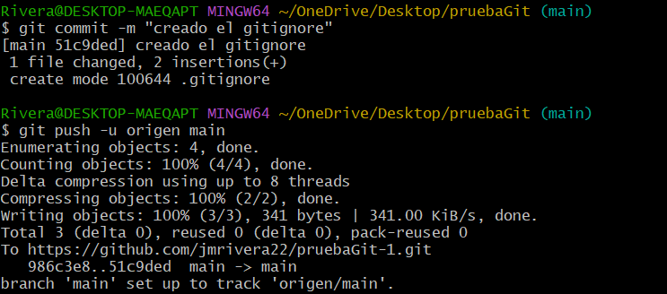

Jose Manuel Rivera Boza
jmriverab@iescastelar.com
SAD (Seguridad y Alta Disponibilidad)

He creado el README.md con gitHub,una vez creado lo he clonado con el comando git clone en la terminal de git,como se muestra en la captura.

El archivo con creedenciales falsas .gitignore lo he creado en el repositorio local,he introducido las creedenciales en el archivo con el comando nano y finalmente lo he subido al repositorio remoto.

Por último,adjunto una captura de que se ha realizado todo lo que pedía la actividad y se ha subido a gitHub.
