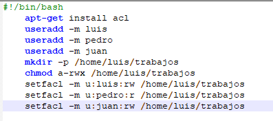
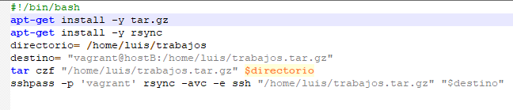

Jose Manuel Rivera Boza

APARTADO 1-
Para este primer apartado de ACL he creado un script el cual realiza lo siguiente:
	1.1- Instalamos acl 
	1.2-Creamos los usuarios luis,pedro y juan
	1.3-Creamos el directorio /home/luis/trabajos
	1.4-borramos todos los permisos con chmod a-rwx para ahora darle los permisos que queramos a los usuarios
	1.5-Le damos los permisos de lectura,de escritura o ambos a los usuarios con setfacl -m

APARTADO 2-
Para este segundo apartado he realizado otro script con el cual haremos lo siguiente:
	2.1-Instalamos en la maquina,en ambas, tar.gz y rsync 
	2.2-Guardamos en la variable "directorio" la ruta del directorio que queremos hacer la copia de seguridad
	2.3-Guardamos en la variable "destino" el lugar donde queremos enviar la copia de seguridad
	2.4-Comprimimos con  tar el directorio del que queremos hacer la copia de seguridad en nuestro caso /home/luis/trabajos
	2.5-Utilizamos rsync para enviar al hostB el directorio trabajos,para ello tendremos que utilizar sshpass -p para que se introduzca la contraseña al levantar el vagrantfile

BIBLIOGRAFIA:Todo ha sido sacado de mis apuntes y mi github quitando un pequeño detalle de sintaxis de sshpass -p que lo he buscado en internet.

