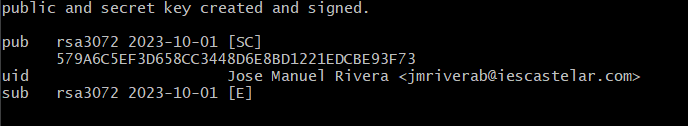
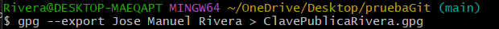
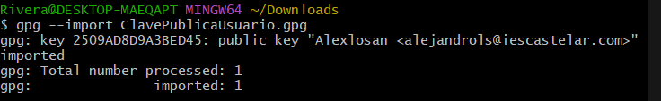
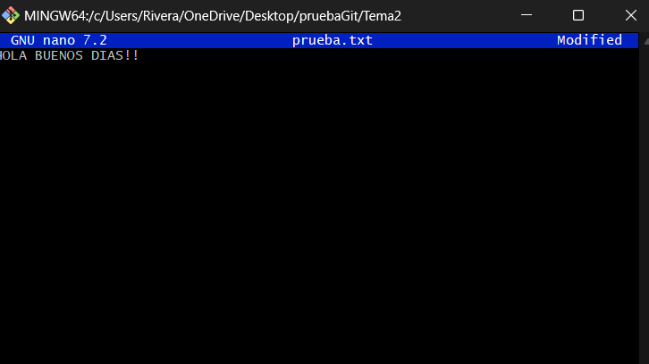
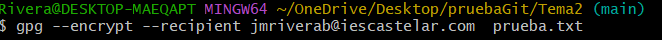
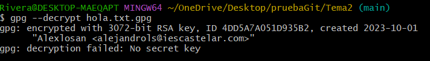

EJERCICIO 1-
Si un año tiene 365 días, calcular cuanto tiempo podría estar como "no disponible" cada uno de los sistemas con disponibilidad:

	1.1- 99% -> (99*365)/100 = 361,35 // 365-361,35 = 3,65 dias o 87,6 horas.
	1.2- 99,9% -> (99,9*365)/100 =364,635 // 365-364,635 = 0.365 dias que es lo mismo que 8.76 horas.
	1.3- 99,99% -> (99,99*365)/100 = 364,9635 // 365-364,9635 = 0,0365 dias que es lo mismo que 0.876 horas que es lo mismo que 52,56 minutos.
	1.4- 99,999% -> (99,999*365)/100 =364,99635 // 364,99635-365 = 0,0365 dias que es lo mismo que 0,0876 horas que es lo mismo que 5,256 minutos que es lo mismo que 315,36 segundos.

EJERCICIO 2-
Calcula los requisitos que ha de cumplir el SAI que proteja:
	2.1-Tu puesto de trabajo -> Suponiendo que mi ordenador consumiese 700W y el factor de potencia es de 0.75 entonces calculamos la potencia aparente dividiendo 700/0,75= 930VA por lo cual con un SAI de 950VA tendriamos protegido nuestro puesto de trabajo.
	2.2-El aula -> Suponiendo que en el aula hay 30 equipos que consumen 700W cada uno y el factor de potencia es de 0,75 y queremos calcular la potencia aparente dividimos lo que consumen todos los equipos entre 0,75 que da como resultado 28000VA o 28KVAS. Si queremos tener en cuenta que se puede ampliar la clase en un futuro, tendriamos que aumentar en un 20-30% la potencia aparente,que daria como resultado aumentando un 20% un SAI de 33600VA.

EJERCICIO 3-
Mi compañero para esta actividad ha sido Alejandro Lopez Santos.

Para este ejercicio hemos generado las llaves con el comando gpg --full-generate-key como podemos observar en la siguiente captura.

Y observamos que las claves se han creado correctamente como nos indica la salida del comando

Para poder intercambiar llaves públicas primero tendremos que exportarlas a un fichero que en mi caso es ClavesPublicasRivera.gpg para poder enviarle el fichero a nuestro compañero.

Una vez que nuestro compañero nos ha pasado el fichero de sus claves públicas tendremos que importarlas como se muestra en la captura.

Creamos un fichero que en mi caso es prueba.txt y lo encriptaremos con el comando gpg --encrypt

Finalmente,habiendole pasado el archivo encriptado a nuestro compañero podemos desencriptarlo con el comando gpg --decrypt pero a nosotros nos ha dado un fallo que no hemos sido capaz de solucionar.

 
