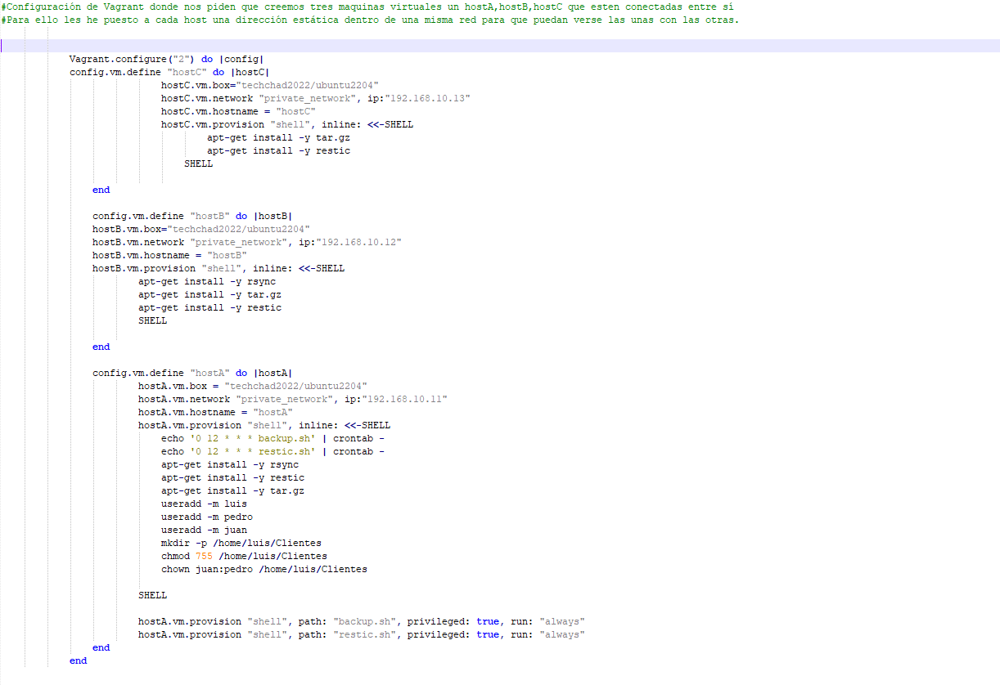

Jose Manuel Rivera Boza

Primeramente crearemos en el archivo Vagrantfile los tres maquinas virtuales las cuales he llamado hostA,hostB y hostC.
A cada una le he asignado una dirección ip dentro de la misma red y se comunican entre ellas haciendo ping dentro de 
cualquiera de las máquinas virtuales.

En esta captura del VagrantFile podemos observar la creación de las tres máquinas virtuales,donde
en el host C instalaremos tar.gz y restic, en el host B instalaremos rsync tar.gz y restic y en el
host A rsync,restic y tar.gz además de crear los usuarios Luis Pedro y Juan con el comando useradd
creamos el directiorio clientes dentro del home de Luis y le damos permisos a los demás usuarios con
el comando chmod y chown.

Támbien tenemos programado el crontab para que a las 12 de la mañana ejecute los scripts backup.sh 
y restic.sh lo cúal me ha dado error al levantar las máquinas con los scripts incluidos en el 
vagrantfile cuando sin incluirlos me levantaba bien la máquina y he podido hacer ping 

En esta captura del script de backup vamos a declarar unas variables que son fecha,directorios y 
destiono donde almacenaremos la fecha,los directorios que queremos copiar con el backup y el 
destino del backup respectivamente.Lo comprimimos usando tar.gz y lo sincronizamos con el host B
mediante rsync.

En esta captura del script restic.sh observamos que creamos tambien una variable donde guardaremos 
la fecha para despues ponersela al fichero. Utilizamos el comando restic para copiar los directorios
que queremos,en nuestro caso /home y /etc y lo sincronizamos con rsync al host C para que funcione
copiando los directorios en el home del host C
