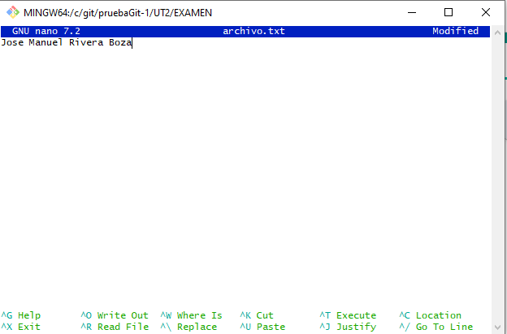
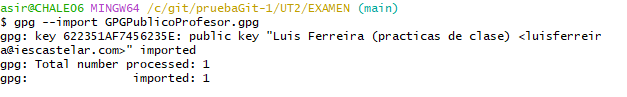
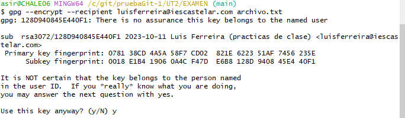
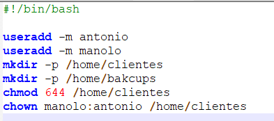

Jose Manuel Rivera Boza

Ejercicio 2-
Primero he creado el archivo.txt y me he descargado el par de llaves,las cuales he importado y he cifrado el archivo.txt llamandolo punto2encriptado.gpg
los comandos usados para esta tarea son gpg --import , gpg --encrypt --recipient 

 

Ejercicio 3-
Para este ejercicio he creado la maquina virtual en la cual he añadido un script donde se crean los usuarios los directorios y se les da los permisos necesarios a cada uno.
El script seria es el siguiente.

No me ha dado tiempo a crear el segundo script para hacer el backup.
