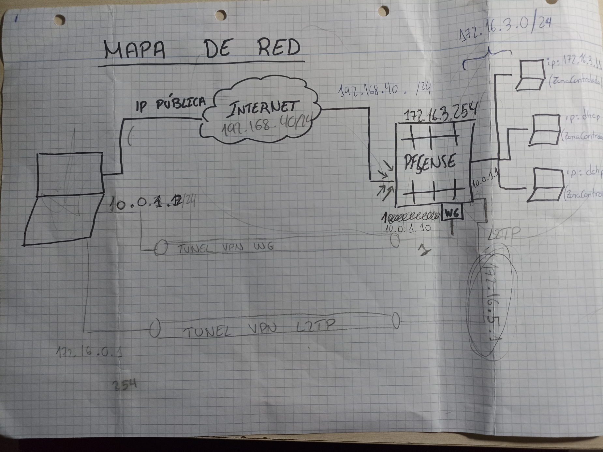

Este es el mapa de red de este trabajo:

PFSENSE.

Creamos una máquina virtual con recursos limitados,con un adaptador de red en modo puente y el otro en una red interna(ZonaControlada).
Instalamos pfsense en la máquina virtual que hemos creado y posteriormente configuramos el firewall.
Arrancamos el firewall y configuramos con la opción 1 las interfaces WAN Y LAN, con la opción 2 indicamos que la interfaz WAN reciba la dirección IP por DHCP y para la LAN le introducimos una estática la 172.16.3.254/24,además,activaremos el DHCP en la interfaz LAN para que asigne direcciones IP en el rango 172.16.3.10-172.16.3.150.

CREACIÓN DE MÁQUINAS.

Vamos a crear 3 máquinas virtuales conectadas a la red interna (ZonaControlada).
La primera máquina (Cliente4) tendrá entorno gráfico de escritorio y una IP estática 172.16.3.11, desde este equipo accederemos y gestionaremos el firewall.
La segunda máquina (Cliente5) no tendrá entorno de escritorio, su dirección IP se le asignará por DHCP y le instalaremos docker e iptable.Además,crearé un index con mi nombre y apellidos
La tercera máquina (Cliente6) tampoco tendrá entorno de escritorio y su dicrección IP se le asignará por DHCP, este equipo dispondrá de las herramientas wget y curl.

Importante que a la hora de levantar las máquinas virtuales tengamos el firewall encendido,y una vez levantadas poner todas las máquinas a host-only para que salgan por el firewall.

L2TP.

Para crear un túnel L2TP accedemos a la interfaz web del firewall desde cliente4,accedemos en el menú a L2TP y lo habilitamos.
Configuramos la dirección del servidor como la de la subred de los clientes que usen el túnel,en mi caso la dirección del servidor será la 172.16.5.1 y la subred 172.16.5.128/25.
Indicamos el número de clientes L2TP que podrán utilizar el túnel a la vez que en mi caso es 10 y la autentificación tipo CHAP.
Creamos un usuario que en mi caso es mi nombre con mis apellidos jmriverab para dar de alta al usuario para que utilice el túnel.

	Protocolo IPsec.
	Una vez habilitado el túnel L2TP vamos a configurar Ipsec,primero vamos al apartado de mobile clients y habilitamos IPsec,la autentificación de usuarios será por Local Database
	Configuramos la fase 1 de IPsec, seleccionando IKEv1,interfaz WAN, autentificación:Mutual PSK , Modo de negociación: Agressive, mi Identificador que será mi nombre jmriverab y el algoritmo de incriptación AES de 128 bits.
	Configuramos la fase 2 de IPsec, seleccionando lo siguiente: Modo transporte, Protocolo ESP, algoritmo de encriptación el anterior, algoritmo HASH: SHA-1 Y SHA-266 y PFS KEY GROUP off.
	Agregamos un nuevo Identificador que permitirá allusers,secret type:PSK y la contraseña que nosotros queramos para la clave compartida.
	
Por último tendremos que crear una regla del firewall añadiendo:
	Action: Pass
	Interface: WAN
	Address Family: IPv4
	Protocol: UDP
	Source: any
	Destination: WAN Address en el puerto 1701(L2TP).

Ya tendriamos preparado el túnel,para conectarnos a él por ejemplo desde un cliente windows nos vamos al apartado VPN y ponemos la dirección del servidor (WAN),y nos pedirá creedenciales que serán las del usuario creado anteriormente,una vez introducidas ya estaremos utilizando el túnel.

WIREGUARD.

Lo primero para crear un túnel Wireguard es instalar su paquete en package manager,una vez instalado nos vamos a la configuración de wireguard y lo habilitamos.
Añadimos un nuevo túnel y añadimos el puerto 51820,generamos un par de llaves y le damos una dirección que no este en uso,en mi caso 10.0.1.10/24.
Configuramos la interfaz una vez añadido el túnel en avaiable network ports y accedemos a OPT1 y añadimos IPv4 configuration type: static IPv4, IPv4 adresses:10.0.1.12/24.
Por último añadimos las siguientes reglas:
	1 WAN
     Accion: Pass
     Protocolo: UDP
     Source: any
     Destination WAN address 51820

	2 WireGuard
		 Todo a any

	3. VPN
		 Todo a any		 		 

Añadimos un peer con el nombre que queramos darle al túnel,la clave pública del cliente que queremos conectar y permitimos todas las IP.

Para conectarnos desde un cliente por ejemplo windows,descargamos wireguard en el cliente,abrimos la aplicación y añadimos un nuevo túnel vacío donde vamos a editar lo siguiente:
	ListenPort=51820
	Address=10.0.1.12/24

	[peer]
	PublicKey="La clave pública del servidor"
	AllowedIPs=0.0.0.0/0
	Endpoint="IP pública,en mi caso 192.168.40.173":51820

Aceptamos los cambios y tendremos ya listo el túnel y estaremos conectados a él.	

PD:deshabilitar una regla que viene por defecto en el firewall que no deja funcionar bien al túnel wireguard y hablitar en el firewall el UID ya que sino le entrega la misma ip por dhcp a los dos equipos.  