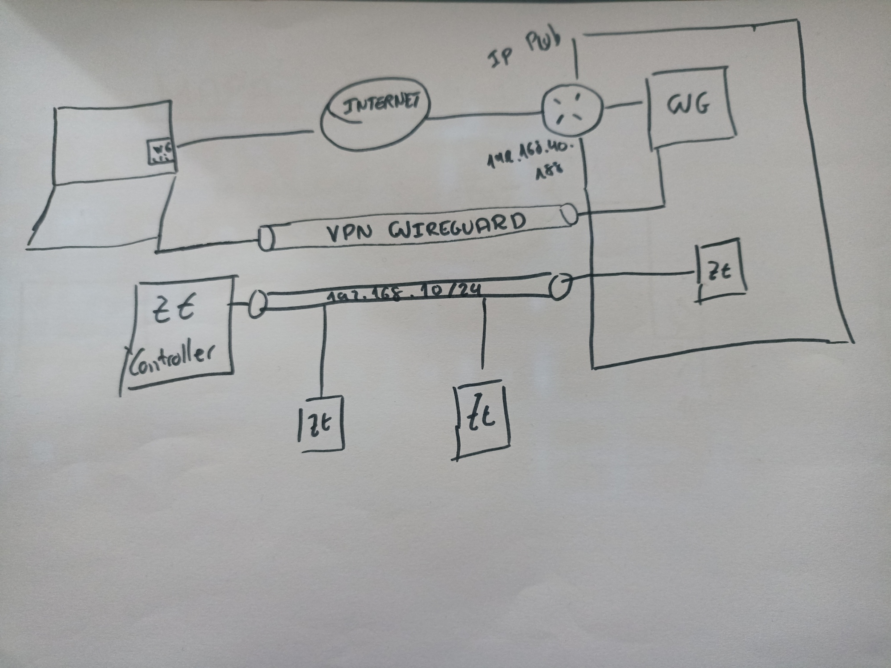

DOCUMENTACIÓN.

En primer lugar muestro una imagen del mapa de red de este trabajo:

Tenemos una máquina virtual con interfaz en modo brigde,con una carpeta sincronizada con el directorio vagrantfile y en la que hemos instalado docker-compose y levantado el docker-compose.yml

WIREGUARD.
Una vez levantado el el contenedor wireguard con docker-compose up -d,podremos acceder a la interfaz web de wireguard con la siguiente url http://IpPública:8080 , una vez dentro accedemos con la contraseña que tenemos en mi caso 123456789 y añadimos un nuevo cliente que nos proporcionará un código QR que escaneandolo desde el móvil con la aplicación wireguard entraremos en el túnel.

ZEROTIER.
Si hemis levantado el archivo.yml tendremos también un contenedor zerotier, que si nos registramos en la página oficial de zerotier podremos añadir una red la cual introduciremos en la máquina con el comando docker exec zerotier-one zerotier-cli join "Clave red", y habremos unido la máquina a la red de zerotier,si queremos que se le otrogue dirección IP dentro de la red de zerotier tendremos que así indicarlo en la web al quedar registrado el equipo "AUTH".
